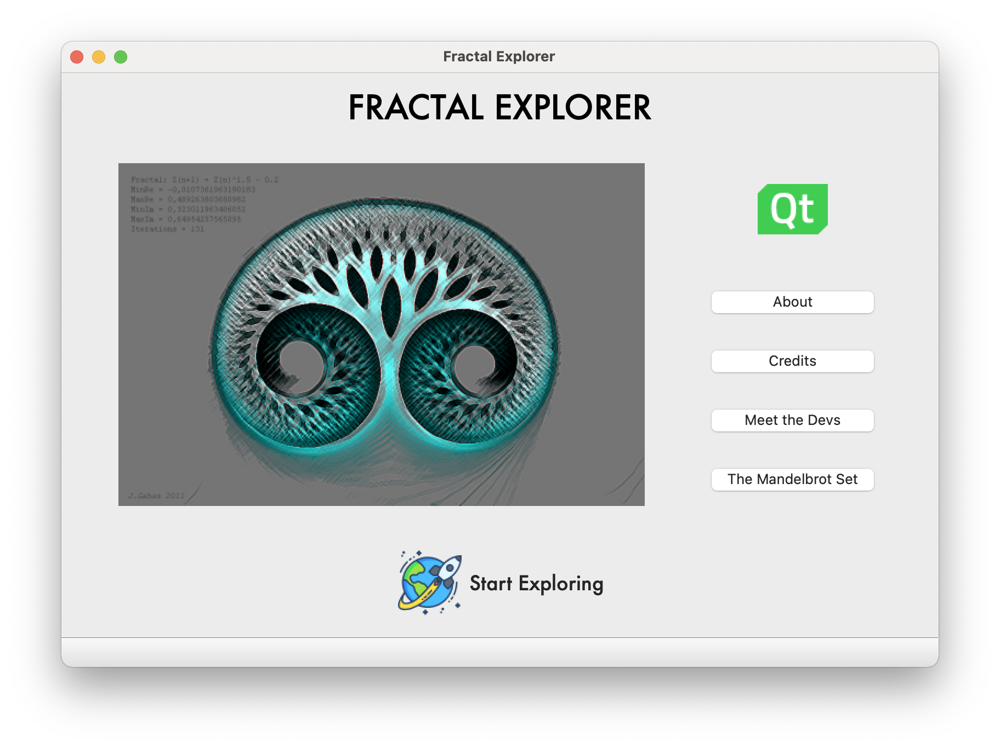

# Fractal Explorer

### About this Project

This program serves as a final project in Discrete Structures for Riverside City College. The purpose of the app is to demonstrate understanding of recursive sequences and series as well as sets. This project uses the recursive function discovered by Benoit Mandelbrot, , and renders values in the complex plane.

## Coloring
By definition, a value can either be in a set or not. This begs the question, why does the fractal explorer contain a range of colors and not just two? The answer comes from coloring values ‘close’ to the set with a brightness ranging from complete brightness (white) to black (no darkness). Because colors are rendered using the HSV color model, any hue can be selected without affecting the value range described above.

## Why So Slow?
In order to determine if a value is inside the Mandelbrot set, it must be iterated until it either hits a maximum number threshold or has a magnitude greater than 2. Some values in the set increase so slowly, that you could iterate thousands and thousands of times before it reaches the threshold. Values far the edges usually break that threshold pretty fast, however values closer to the edge iterate a larger number of times before breaking the threshold. Keep in mind that each pixel represents a point that must be iterated through the Mandelbrot algorithm and you can start to understand the problem. 

Still need some perspective? Imagine that each pixel had to iterate the default cap: 80 iterations. If the default window size is 800 x 600, that means the computer must calculate the loop 800*6000*80 times. That’s 38.4 million times. Even worse, for each iteration, the computer has to multiply two complex numbers and add the original one. Thankfully, computers are really good at math, so it loads in a few seconds for fairly small zoom.

## What is the Mandelbrot Set?
Benoit Mandlebrot was able to map out stable, and unstable values by using his simple, yet powerful formula. Instead of simply squaring a value, he would also add a complex number to it. If we were to square '4', and continue squaring it, it would become a very large number; however, what would happen if we were to continue squaring a number less than 1? If we were to continue squaring '0.9' over, and over again, it would eventually become a very small number. Its breakpoint is at the value of '1'  so essentially it's like a finding the limit as the value approaches the number '1' from either sides. By plotting these values we can see how volatile, and amazing the Mandelbrot set really is.

The graphical representation of the Mandelbrot set on the complex planes yields one of the most famous and visually stunning fractals we know of. It is one of the few things in the universe which is known as “infinitely complex”, meaning that the complexity of the design forever increases the deeper you explore the fractal. But don’t take our word for it. See for yourself!

## Screenshots

